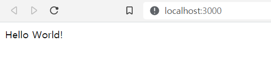
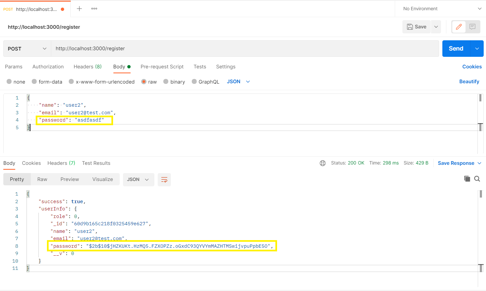
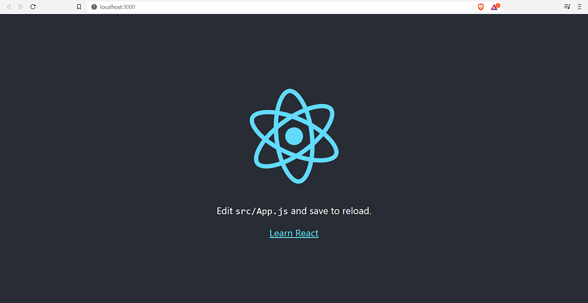

# node-react-boilerplate

## John Ahn 님의 [노드 리액트 기초 강의](https://www.youtube.com/playlist?list=PL9a7QRYt5fqkZC9jc7jntD1WuAogjo_9T) 따라코딩👶

### 프로젝트 시작하기

node 설치 후 프로젝트 폴더 만들기

```ps1
# 설치된 node 버전 확인
C:\...\Documents> node -v
v14.16.0

# 프로젝트 폴더 만들기
C:\...\Documents> mkdir node-react-boilerplate

# 만들어진 폴더로 이동
C:\...\node-react-boilerplate> cd node-react-boilerplate

# npm 패키지 만들기
C:\...\node-react-boilerplate>npm init

package name: (test)
version: (1.0.0)
description:
entry point: (index.js)
test command:
git repository:
keywords:
author:
license: (ISC)
...
Is this OK? (yes)

```

### git & github 시작하기

```ps1
echo "# node-react-boilerplate" >> README.md
git init
git add README.md
git commit -m "first commit"
git branch -M main
git remote add origin https://github.com/inhalin/node-react-boilerplate.git
git push -u origin main
```

### `.gitignore` 파일에 추가할 것들

- node_modules
- dev.js

### `.gitignore`가 적용되지 않을 때 해결법

```ps1
git rm -r --cached .
git add .
git commit -m "fixed untracked files"
```

### 비밀 설정 정보 관리

`index.js`에서 MongoDB 연결을 위해 URI를 그대로 넣어주면 아이디와 비밀번호가 노출되기 때문에 보안상 심각한 문제가 있다.

설정 정보 파일을 만들어줄 `config` 폴더를 생성하고 [`key.js`](./config/key.js)에서 환경변수에 따라 가져올 파일을 설정해준다.

로컬 환경에서는 `dev.js`에서 정보를 가져오고, 프로덕션 환경에서는 `prod.js`에서 정보를 가져와서 DB에 연결해준다.

`dev.js`는 깃허브에서 공유하면 안되는 파일이므로 `.gitignore`에 추가해준다.

---

## node modules

### 설치한 패키지 목록

- `express` node.js framework
- `mongoose` MongoDB 사용 편의를 위한 모듈
- `nodemon` 소스가 변경되면 자동으로 감지해서 서버를 재가동해줌
- `bcrypt` 비밀번호 암호화
- `jsonwebtoken` 로그인시 토큰 생성
- `cookie-parser` 생성한 토큰을 cookie에 저장
- `react` FE 라이브러리

### npm 패키지 설치하기

원하는 모듈을 검색해서 아래 명령어를 터미널에 실행

```ps1
# npm 5.x 이전
npm install <package-name> --save

# npm 5.x 이상
npm install <package-name>

# 개발환경에서만 사용
npm install <package-name> --save-dev

# dependency에 추가 X
npm install <package-name> --no-save
```

npm 5.x 이전에는 `--save` 옵션을 써줘야 `package.json`의 dependencies 항목에 패키지가 추가되었다.

하지만 5.x 부터는 `--save` 옵션을 사용하지 않아도 자동으로 dependencies에 패키지가 추가된다.

`--save-dev` 옵션을 사용하면 devDepndencies에 패키지를 추가한다.

### 사용중인 npm 패키지 업데이트 하기

```ps1
# 업데이트 가능한 패키지 확인
npm outdated

# 전체 패키지 최신버전으로 업데이트
npm update

# 명시된 패키지의 최신버진으로 업데이트
npm update <package-name>

# 명시된 패키지의 명시된 버전으로 업데이트
npm update <package-name@version>
```

---

### express로 앱 시작하기 - Hello World!

> https://expressjs.com/en/starter/hello-world.html

```js
// npm으로 install한 express 모듈 가져오기
const express = require("express");

// express() 메서드를 이용해서 새로운 app 만들기
const app = express();

// 사용할 백서버 포트번호 지정
const port = 3000;

// root 디렉토리에 들어오면 send() 안의 부분을 출력
app.get("/", (req, res) => {
  res.send("Hello World!");
});

// 위에서 지정한 포트번호에서 앱을 실행하고 콘솔에 로그 출력
app.listen(port, () => {
  console.log(`Example app listening at http://localhost:${port}`);
});
```

`index.js`에 위 코드를 복붙하고 터미널에 `npm run start`로 서버가 정상적으로 켜지면 콘솔에 `app.listen()`의 `console.log` 내용이 출력된다.

`app.get()`의 `send()` 안의 내용은 터미널에 `curl http://localhost:3000/`로 Content에 내용이 들어간 것을 확인한다.

```ps1
C:\...\node-react-boilerplate> curl http://localhost:3000/

StatusCode        : 200
StatusDescription : OK
Content           : Hello World!
...
```

또는 브라우저에서 `http://localhost:3000`로 들어가면 화면에 출력된 것을 볼 수 있다.



### curl 에러

- curl : URI 접두사를 인식할 수 없습니다.

윈도우에서는 그냥 `curl localhost:3000`으로 하면 안되고 꼭 `curl http://localhost:3000`과 같이 전체 uri를 다 써줘야 된다.

- curl: Internet Explorer 엔진을 사용할 수 없거나 Internet Explorer의 최초 실행 구성이 완전하지 않아 응답 콘텐츠를 구문 분석할 수 없습니다. UseBasicParsing 매개 변수를 지정하고 다시 시도하십시오.

IE 처음 켜면 설정창 뜨는 것 확인해주면 해결된다.

---

### nodemon 사용하기

개발환경에서만 사용하도록 설치하기

```ps1
npm install nodemon --save-dev
```

서버를 실행할 때 nodemon을 사용하기 위해 `package.json`에 script 추가

```json
"scripts": {
    ...
    "dev": "nodemon index.js",
    ...
  },
```

nodemon으로 서버 실행하기

```ps
npm run dev
```

---

### Bcrypt로 비밀번호 암호화

비밀번호를 DB에 저장할 때 사용자가 입력한대로 바로 저장되면 보안성이 떨어진다.

bcrypt를 사용해서 암호화한 문자열을 DB에 저장하면 관리자도 사용자의 비밀번호를 알 수 없도록 해줘야 한다.

회원가입 시 작성한 내용을 DB에 저장하기 전에 비밀번호를 암호화해줄 메서드를 User 모델에서 정의해준다.

비밀번호가 변경될 경우에만 암호화 한번 실행, 나머지 경우에는 바로 넘어가기

> https://www.npmjs.com/package/bcrypt

```js
// User.js

const bcrypt = require('bcrypt');
const saltRounds = 10;

...(생략)

userSchema.pre('save', function(next) {
  const user = this;

  if(user.isModified('password')) {
    bcrypt.hash(user.password, saltRounds, function(err, hash) {
      // Store hash in your password DB.
    });
  } else {
    next();
  }
});
```



---

### Bcrypt로 로그인 기능 구현

`index.js`에 로그인 라우트 추가

```js
app.post('/login', (req, res) => {
  ...
}
```

입력한 이메일과 일치하는 정보가 DB에 있는지 확인하고, 있으면 비밀번호가 일치하는 지 확인한다.

```js
app.post('/login', (req, res) => {
  User.findOne({email: req.body.email}, (err, user) => {
    if(!user) return ...

    user.comparePassword(req.body.password, (err, isMatch) => {
      if(!isMatch) return ...
    });

    ...
  });
}
```

모두 일치하면 jsonwebtoken을 이용해서 토큰을 생성하고 cookie에 저장한다.

```js
app.post('/login', (req, res) => {
  User.findOne({email: req.body.email}, (err, user) => {
    if(!user) return ...

    user.comparePassword(req.body.password, (err, isMatch) => {
      if(!isMatch) return ...
    });

    user.generateToken((err, user) => {
      if(err) return ...

      res.cookie("x_auth", user.token).status(200).json({...});
    });
  });
}
```

#### User 모델에 추가할 것들

- jsonwebtoken 불러오기
- cookie-parser 불러오기
- `index.js`에서 사용하는 메서드 정의 - `comparePassword()`,` generateToken()`
- `userSchema.methods.comparePassword`는 매개변수로 입력한 비밀번호, 콜백함수 두개를 받는다.
- `userSchema.methods.generateToken`는 매개변수로 콜백함수 하나를 받는다.

---

### Authentication

auth 미들웨어 정의

---

### 로그아웃 기능

---

### npm vs npx

#### npm - node package manager

- 레지스트리 저장소 역할. npm install로 다운로드 받은 모듈은 registry에 저장된다.
- 어플리케이션을 빌드할 때 사용. 패키지 설치, 버전 관리, 디펜던시 관리 등.
- npm에 관한 것은 전부 `package.json`에 정의되어 있다.
- 로컬로 다운받은 패키지는 `node_modules` 폴더에 저장되어 해당 프로젝트 안에서만 사용 가능하다.
- 글로벌로 다운받은 패키지는 내 컴퓨터 안에 다운이 받아진다.

#### npx

- 글로벌로 다운받지 않아도 npm registry에서 자동으로 모듈을 찾아서 다운로드 없이 실행해준다.
- 디스크 스페이스를 낭비하지 않고 항상 최신 버전을 사용할 수 있다.

---

### react 구조 설명



client 디렉토리에서 `npm run start`로 react를 시작하면 홈화면이 위와 같이 뜬다. 이 화면은 `client\src\App.js`의 `function App()`이 렌더링 된 화면이다.

```js
// client\src\App.js

function App() {
  return (
    <div className="App">
      <header className="App-header">
        
        <p>
          Edit <code>src/App.js</code> and save to reload.
        </p>
        <a
          className="App-link"
          href="https://reactjs.org"
          target="_blank"
          rel="noopener noreferrer"
        >
          Learn React
        </a>
      </header>
    </div>
  );
}
```

`index.js`의 `ReactDOM.render()` 안에서 App 컴포넌트를 가져온다.

```js
// client\src\index.js

import App from "./App";

ReactDOM.render(
  <React.StrictMode>
    <App /> {/* 여기에 보여주고 싶은 컴포넌트를 넣어준다 */}
  </React.StrictMode>,
  document.getElementById("root") // 컴포넌트 보여줄 곳 지정
);
```

`cliend\public\index.html` 파일 안에 있는 `id=root`인 요소에 렌더링할 컴포넌트를 보여준다.

```html
<div id="root">
  <!-- 여기에 컴포넌트 내용을 보여준다 -->
</div>
```


### webpack

webpack은 src 안에 있는 파일들만 관리한다. public 아래에 있는 파일들은 건드리지 않는다. webpack으로 관리하고 싶은 이미지나 js 등의 파일들은 src 디렉토리 안에 같이 넣어주어야 한다.
